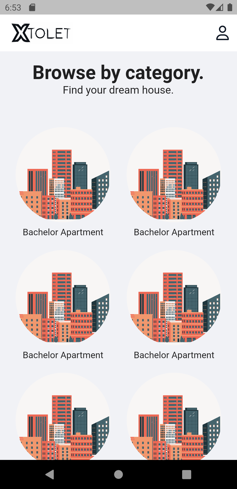

# xtolet

A new Flutter project. This project is a clone of the popular property listing app, https://xtolet-j9iwvgze7-mamun-swe.vercel.app/?fbclid=IwAR2kMzr1zWYVof4JOEQlP9Myw7QkcADBNQ1PJBAaAofeUR9tid3mJ1bfr-A. It is built using Flutter and Firebase. The app is still under development.

## Screenshots

